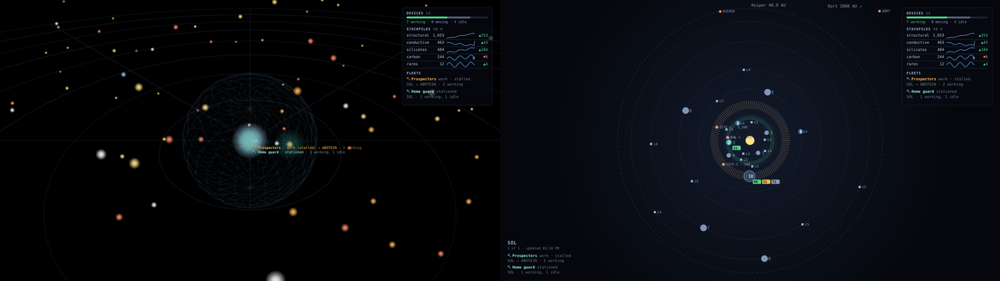

# Replicant Space wallpaper for Octos

Your [Replicant Space](https://replicant.space) galaxy and star systems as a live Windows desktop wallpaper, using
[Octos](https://github.com/underpig1/octos). It shows the same maps as your
[Replicant Space web client](https://github.com/sk3ynet/replicant.space-frontend): your systems and replicants, relay
and hub range, scanned systems, ships in transit and your fleets, all live, with a dashboard panel showing device
activity, your stockpiles with a 48-hour trend, and each fleet's mission.



This is an optional add-on. The web client works the same without it.

## What you need

- Windows 10 or 11 with [Octos](https://github.com/underpig1/octos#quickstart) installed.
- Your Replicant Space web client, version **1.28.0 or later** (1.29.0 for fleets and the dashboard panel, 1.30.0 for supply lines), reachable from that PC (for example
  `https://replicant.example.com`).

## Install

1. Download `ReplicantSpace.zip` from this repository's
   [Releases](https://github.com/sk3ynet/replicant-space-octos/releases), or build it yourself with
   `./scripts/build.sh` (it ends up in `dist/`).
2. In the Octos app, choose **Install mod from .zip** and pick `ReplicantSpace.zip`.
3. In your web client, open **Account › Desktop wallpaper** and press **Create wallpaper link**. Copy the link it
   shows. It's only shown once.
4. In Octos, open the **Replicant Space** wallpaper's settings and paste the link into **Wallpaper link**.

## Settings

| Setting | What it does |
|---|---|
| Wallpaper link | The link from Account › Desktop wallpaper. Without it the wallpaper shows the setup steps. |
| Show | **Galaxy** (3D, slowly turning), **One system**, or **Cycle my systems** (every system with your devices, in turn). |
| System | For *One system*: which one, e.g. `FALQUORYX`. For *Galaxy*: the star to centre on. Blank centres on your replicant. |
| Show labels | Star and place names, and the labels of ships in transit. |
| Show relay/hub range | The faint spheres around your relays (7.5 ly) and hubs (15 ly) on the galaxy. |
| Show fleets | On the galaxy, a teal ring where each fleet's devices are, labelled with what the fleet is doing (mission phase, how many devices are working / moving / idle), and a dashed line to the system its mission is headed for. Stalled fleets show in amber. In the system views, the fleets in that system are listed under its name. Needs client 1.29.0. |
| Show supply lines | Arcs between your fleets' systems: amber where a fleet's materials go (or a mining mission delivers), blue along a trade fleet's run. Faint and dotted while only planned, solid while a ferry or mission runs it, with dots flowing while something travels along it. Also listed in the dashboard panel and under each system. Needs client 1.30.0. |
| Dashboard panel | **Right**, **Left** or **Off**: devices working / moving / idle, stockpiles with their 48-hour trend, and your fleets' missions. Needs client 1.29.0. |
| Galaxy rotation speed | 0 stands still. |
| Refresh every | Minutes between data refreshes. |
| Cycle: seconds per system | For *Cycle my systems*. |

Changes in Octos apply straight away.

## How it works, and what the link can do

A wallpaper can't sign in with Google, so the web client hands out a **wallpaper link** with a key in it:

```
https://your-server/wallpaper/<id>/#key=rsw_…
```

- The key opens **only the map data, read-only**: no commands, no settings, nothing else in the client. The server
  only accepts GET requests on `/wallpaper/`.
- It's stored on the server as a hash, and you can revoke it, or turn the wallpaper off altogether, under
  Account › Desktop wallpaper.
- The key sits after the `#`. Browsers never send that part to a server, so it stays out of access logs; the page
  sends it as a request header instead.
- The maps themselves are drawn by your web client (its `/wallpaper/` pages). This add-on is a small launcher:
  [`launcher.js`](src/replicant-space/launcher.js) reads the Octos settings and shows the right view full-screen. So
  the wallpaper always matches your client's version of the maps, and it needs the server to be reachable. If the
  server goes away for a while, the wallpaper keeps what it last showed and tries again at the next refresh.

## Developing

```
src/replicant-space/
├── octos.json      name, preview images and the settings above
├── index.html      full-screen frame + setup screen
├── launcher.js     settings → the client's /wallpaper/ page
├── octos.min.js    Octos API (MIT, built from underpig1/octos@62170af; see LICENSE-octos.txt)
├── image.png       card image in the Octos app
└── preview.png     preview in the Octos explore page
```

- **In a browser:** open `src/replicant-space/index.html?link=<your wallpaper link, URL-encoded>&view=Galaxy`.
  Outside Octos, the settings come from the address.
- **In Octos:** `octos run src/replicant-space`, then `octos reload` after changes and `octos dev-tools` for
  DevTools.
- **Build:** `./scripts/build.sh` makes `dist/ReplicantSpace.zip`. Pushing a `v*` tag builds it on GitHub and attaches
  it to the release. Or, without a tag: Actions › build › *Run workflow* with a version (e.g. `v1.1.0`) makes the tag
  and the release from `main`.
